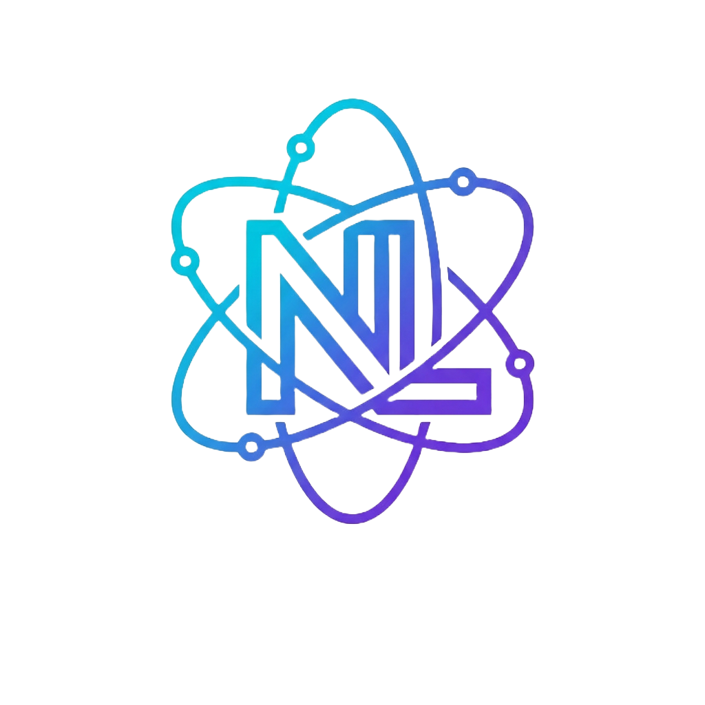

# Nucleo LDAP

**The modern, self-hostable web UI for LDAP administration.**  
Manage users, groups & organizational units on any LDAPv3 server — clean, fast, open source.

---

## Project status

Nucleo is **pre-1.0** and under active development.

---

## Why Nucleo?

Existing LDAP management tools are either outdated,
too complex, or too limited.  
**Nucleo** is built for homelab admins, self-hosters or small organizations who want a
modern, lightweight, and Docker-friendly alternative.

- 🌲 **Generic** — connects to any LDAPv3-compatible server (OpenLDAP, 389DS, lldap)
- ⚡ **Fast & modern** — built with Next.js and NestJS, no legacy stack
- 🔒 **Secure by default** — LDAPS/TLS, JWT auth, full audit log
- 🐳 **Self-hostable** — Easy to deploy
- 🧩 **Adapter-based** — clean hexagonal architecture, easy to extend

---

## Getting Started

### Repository layout

| Repository             | Purpose                                           |
| ---------------------- | ------------------------------------------------- |
| `nucleo-ldap-app-host` | .NET Aspire AppHost and local stack orchestration |
| `nucleo-ldap-web`      | Next.js web application                           |
| `nucleo-ldap-api`      | NestJS API and LDAP adapters                      |
| `nucleo-ldap-docs`     | Project documentation                             |

### Choose your entry point

- Full local stack: start with the AppHost repository
- Frontend only: use the Web repository
- Backend/API only: use the API repository

Each repository has its own setup commands and environment variables.
Read the target repository README for exact install and run instructions.

---

## What you can do (V1)

| Feature                          | V1  |
| -------------------------------- | :-: |
| List, create, edit, delete users | ✅  |
| Reset & manage passwords         | ✅  |
| Manage groups & memberships      | ✅  |
| Connect to OpenLDAP Server       | ✅  |
| LDAPS / TLS support              | ✅  |
| Audit log                        | ✅  |
| Dynamic schema introspection     | ✅  |
| Multi-server profiles            | 🔜  |
| Active Directory support         | 🔜  |
| DIT tree explorer                | 🔜  |
| Connect to any LDAPv3 server     | 🔜  |

---

## Stack

| Layer             | Technology                      |
| ----------------- | ------------------------------- |
| Frontend          | Next.js 15 · TypeScript · React |
| Backend           | NestJS · Fastify · TypeScript   |
| LDAP client       | ldapts                          |
| Dev orchestration | .NET Aspire                     |
| LDAP (dev)        | bitnami/openldap                |

---

## Repositories

| Repo                                                                       | Description                      |
| -------------------------------------------------------------------------- | -------------------------------- |
| [nucleo-ldap-app-host](https://github.com/NucleoLDAP/nucleo-ldap-app-host) | AppHost and local orchestration  |
| [nucleo-ldap-web](https://github.com/NucleoLDAP/nucleo-ldap-web)           | Frontend web application         |
| [nucleo-ldap-api](https://github.com/NucleoLDAP/nucleo-ldap-api)           | Backend API and LDAP integration |
| [nucleo-ldap-docs](https://github.com/NucleoLDAP/nucleo-ldap-docs)         | Documentation                    |

---

## Contributing

Nucleo is in active development and welcomes contributions of all kinds —  
bug reports, feature requests, code, or documentation.

👉 Read the [Contributing Guide](../CONTRIBUTING.md)

For issues and pull requests, open them in the repository that matches the scope of your change.

---
